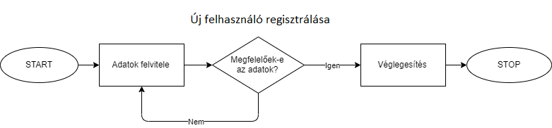

# Rendszerterv

## 1. A rendszer célja
A jelenlegi vírus helyzett miatt a cégünk egy olyan rendszert talált ki ami az ügyfelek számára kedvező lehet. A rendszer célja az, hogy az emberek online interneten keresztül tudjon kölcsönözni járműveket, így minimálisra tudjuk csökkenteni a személyes találkozások számát. Az ügyfél sokféle különböző típusú, márkájú, osztályú autók közül tud válogatni. Ha meg van a szerencsés jármű ezután már csak az időpontot kell, hogy lefoglalja és kész is a kölcsönzés.

## 2. Projektterv

### 2.1 Projektszerepkörök, felelősségek

### 2.2 Projektmunkások és felelősségeik

### 2.3 Ütemterv

### 2.4 Mérföldkövek

## 3. Üzleti folyamatok modellje

### 3.1 Üzleti szereplők
A rendszert regisztrálás nélkül is lehet használni. Ekkor a látogató csak a kezdőlapot tudja elérni, vagy az autókat tudja nézegetni.
Regisztrált üzleti szereplők a bérlő, és az adminisztrátor.

### 3.2 Üzleti folyamatok
Bejelentkezés mindenki számára ugyanolyan lefutású:
A ’Belépés’ menüpontra kattintva megjelenik a ’Felhasználónév’ és ’Jelszó’ beviteli űrlap. A mezők kitöltése után a ’Belépés’ gombra kattint a felhasználó. Ha az azonosítás sikeres, akkor a felhasználó belépett és megjelenik a jogosultságának megfelelő menüsor.
Ha nem sikerül az azonosítás, hibaüzenet jelenik meg.

#### Üzleti folyamatok adminisztrátorok számára:

- Bérlő törlése a rendszerből
- Új autó regisztrálása
- Autó törlése

#### Üzleti folyamatok bérlők számára:
- Katalógus megtekintése: 
A bérlőnek nem szükséges belépnie a rendszerbe a funkció eléréséhez. A felhasználó idő szerint tudja listázni az autókat a rendszerben. A rendszer a találatokat listázza a képernyőn. Ha egy autó sem felel meg a keresési feltételnek, akkor a „Nincs találat.” üzenet jelenik meg a képernyőn.

- Személyes adatok módosítása:
A bérlő a ’Profil’ menü ’Adatok módosítása’ menüpontra kattint. Megjelenik a képernyőn a felhasználó összes adata. A szükséges adat módosítása után az ’Adatok módosítása’ gombra kattint. Az adatok módosítás előtt rendszer ellenőrzi a módosított adat helyességét. Ha az adatok jók, a rendszer az adatbázisban módosítja az olvasó adatait.

### 3.3 Üzleti entitások
-	autó
-	olvasójegy

## 4. Követelmények

### 4.1 Funkcionális követelmények 
- **Kölcsönzők adminisztrációja:** Kölcsönzők regisztrálása, törlése az igényelt üzleti folyamatokban leírtak szerint.  
- **Autók adminisztrációja:** Autók regisztrálása, törlése az igényelt üzleti folyamatokban leírtak szerint.
- **Kölcsönzés adminisztrációja:** Kölcsönzések folyamatának kezelése az igényelt üzleti folyamatokban leírtak szerint.
- **Felhasználói fiókok kezelése:** Bejelentkezés, felhasználói adatok módosítása, intézők, kölcsönzők rögzítése az adatbázisban, listák és kimutatások készítése az igényelt üzleti folyamatokban leírtak szerint.  
- **Platformfüggetlen, robusztus működés:** Szabványos, az iparágban régóta bevált, operációs rendszertől független technológiák használata: Php, Apache HTTP szerver, MySQL.   
- **Költséghatékony üzemeltetés:** A szabványos és elterjedt technológiák használata biztosítja. 
- **Bővíthetőség:** A kezelt adatok mennyiségének, valamint a felhasználók számának bővíthetősége és utólag újabb funkciók hozzáadásának lehetőségének biztosítása.

### 4.2 Nemfunkcionális követelmények
- **Látványos** és egyedülálló dizájn
- **Egyszerű**, gyorsan értelmezhető, letisztult, egyszerűen használható felhasználói felület
- **Online elérhető nyilvános katalógus:** Bárki számára elérhető online felület készítése, amin keresztül elérhető, böngészhető és kereshető a kölcsönözhető autók katalógusának tartalma.
- Részfeladatok megfelelő megjelenítése

### 4.3 Törvényi előírások, szabványok
A személyes adatok kezelésére vonatkozó elvek
(1) A személyes adatok:

a)

kezelését jogszerűen és tisztességesen, valamint az érintett számára átlátható módon kell végezni („jogszerűség, tisztességes eljárás és átláthatóság”);

b)

gyűjtése csak meghatározott, egyértelmű és jogszerű célból történjen, és azokat ne kezeljék ezekkel a célokkal össze nem egyeztethető módon; a 89. cikk (1) bekezdésének megfelelően nem minősül az eredeti céllal össze nem egyeztethetőnek a közérdekű archiválás céljából, tudományos és történelmi kutatási célból vagy statisztikai célból történő további adatkezelés („célhoz kötöttség”);

c)

az adatkezelés céljai szempontjából megfelelőek és relevánsak kell, hogy legyenek, és a szükségesre kell korlátozódniuk („adattakarékosság”);

d)

pontosnak és szükség esetén naprakésznek kell lenniük; minden észszerű intézkedést meg kell tenni annak érdekében, hogy az adatkezelés céljai szempontjából pontatlan személyes adatokat haladéktalanul töröljék vagy helyesbítsék („pontosság”);

e)

tárolásának olyan formában kell történnie, amely az érintettek azonosítását csak a személyes adatok kezelése céljainak eléréséhez szükséges ideig teszi lehetővé; a személyes adatok ennél hosszabb ideig történő tárolására csak akkor kerülhet sor, amennyiben a személyes adatok kezelésére a 89. cikk (1) bekezdésének megfelelően közérdekű archiválás céljából, tudományos és történelmi kutatási célból vagy statisztikai célból kerül majd sor, az e rendeletben az érintettek jogainak és szabadságainak védelme érdekében előírt megfelelő technikai és szervezési intézkedések végrehajtására is figyelemmel („korlátozott tárolhatóság”);

f)

kezelését oly módon kell végezni, hogy megfelelő technikai vagy szervezési intézkedések alkalmazásával biztosítva legyen a személyes adatok megfelelő biztonsága, az adatok jogosulatlan vagy jogellenes kezelésével, véletlen elvesztésével, megsemmisítésével vagy károsodásával szembeni védelmet is ideértve („integritás és bizalmas jelleg”).

(2) Az adatkezelő felelős az (1) bekezdésnek való megfelelésért, továbbá képesnek kell lennie e megfelelés igazolására („elszámoltathatóság”).

Az adatkezelés biztonsága
(1) Az adatkezelő és az adatfeldolgozó a tudomány és technológia állása és a megvalósítás költségei, továbbá az adatkezelés jellege, hatóköre, körülményei és céljai, valamint a természetes személyek jogaira és szabadságaira jelentett, változó valószínűségű és súlyosságú kockázat figyelembevételével megfelelő technikai és szervezési intézkedéseket hajt végre annak érdekében, hogy a kockázat mértékének megfelelő szintű adatbiztonságot garantálja, ideértve, többek között, adott esetben:

a)

a személyes adatok álnevesítését és titkosítását;

b)

a személyes adatok kezelésére használt rendszerek és szolgáltatások folyamatos bizalmas jellegének biztosítását, integritását, rendelkezésre állását és ellenálló képességét;

c)

fizikai vagy műszaki incidens esetén az arra való képességet, hogy a személyes adatokhoz való hozzáférést és az adatok rendelkezésre állását kellő időben vissza lehet állítani;

d)

az adatkezelés biztonságának garantálására hozott technikai és szervezési intézkedések hatékonyságának rendszeres tesztelésére, felmérésére és értékelésére szolgáló eljárást.

(2) A biztonság megfelelő szintjének meghatározásakor kifejezetten figyelembe kell venni az adatkezelésből eredő olyan kockázatokat, amelyek különösen a továbbított, tárolt vagy más módon kezelt személyes adatok véletlen vagy jogellenes megsemmisítéséből, elvesztéséből, megváltoztatásából, jogosulatlan nyilvánosságra hozatalából vagy az azokhoz való jogosulatlan hozzáférésből erednek.

(3) Az adatkezelő, illetve az adatfeldolgozó 40. cikk szerinti jóváhagyott magatartási kódexekhez vagy a 42. cikk szerinti jóváhagyott tanúsítási mechanizmushoz való csatlakozását felhasználhatja annak bizonyítása részeként, hogy az e cikk (1) bekezdésében meghatározott követelményeket teljesíti.

(4) Az adatkezelő és az adatfeldolgozó intézkedéseket hoz annak biztosítására, hogy az adatkezelő vagy az adatfeldolgozó irányítása alatt eljáró, a személyes adatokhoz hozzáféréssel rendelkező természetes személyek kizárólag az adatkezelő utasításának megfelelően kezelhessék az említett adatokat, kivéve, ha az ettől való eltérésre uniós vagy tagállami jog kötelezi őket.

## 5. Funkcionális terv

### 5.1 Rendszerszereplők
A rendszerünkben két rendszerszereplő csoportot különböztetünk meg. Az egyik az autót kölcsönző felhasználók csoportja. A másik az autók adminisztrációját végző adminok csoportja. A felhasználók igénybe veszik a kölcsönző szolgáltatásait, míg az eladók ezt nyilvántartják és kiszolgálják a felhasználókat. Az eladók több jogosultsággal rendelkeznek, mint az átlagos felhasználó. Az ő feladatuk még a felhasználók értesítése problémák esetén, új autók felvétele a rendszerbe, autó törlése a listából stb. Az eladók csoport része az adminisztrátori jogosultsággal rendelkező eladók csoportja, akik teljes jogosultsággal rendelkeznek. Ők végzik a rendszerben az eladók adminisztrálását.

### 5.2 Rendszerhasználati esetek és lefutásaik 

### 5.3 Határ osztályok 
